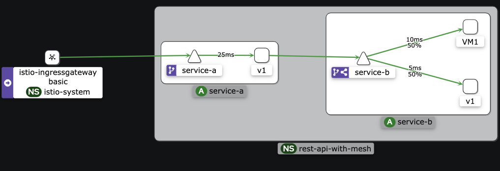
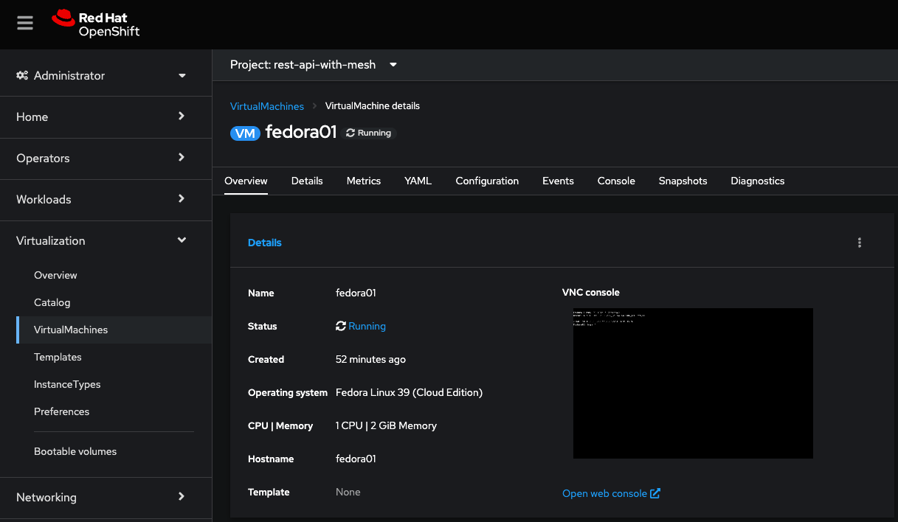
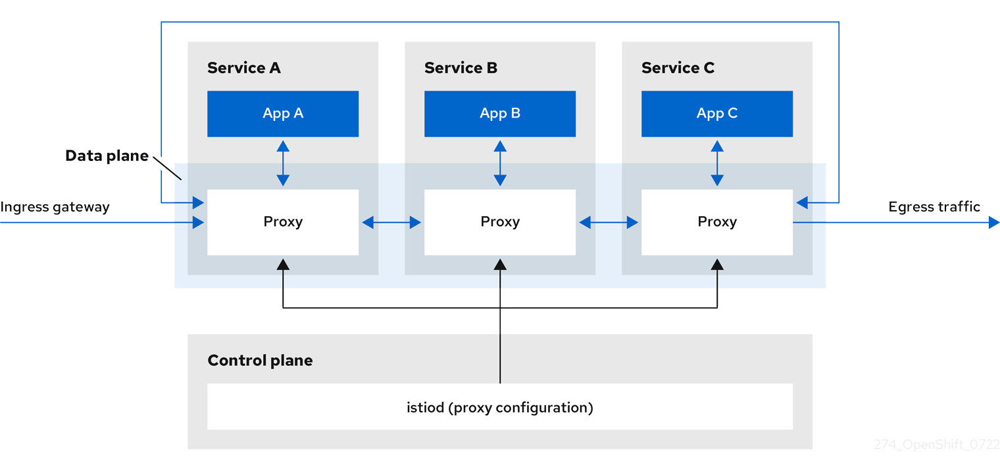
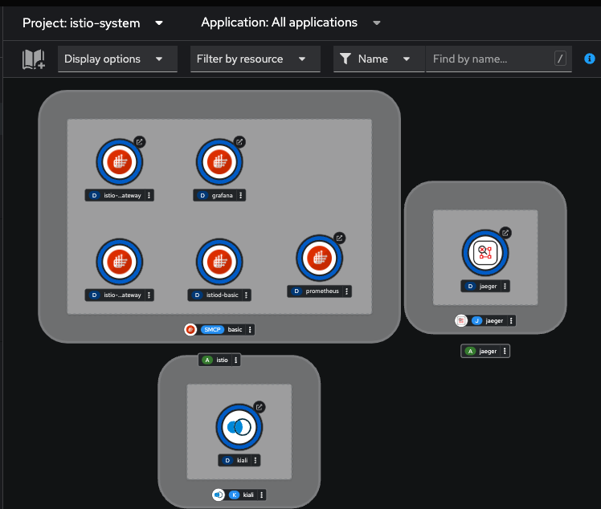
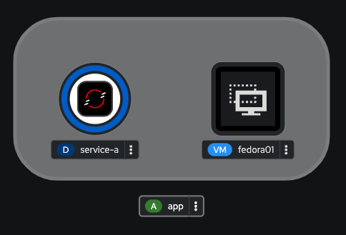
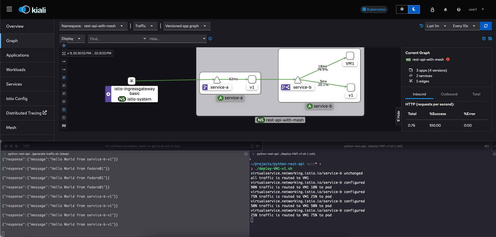
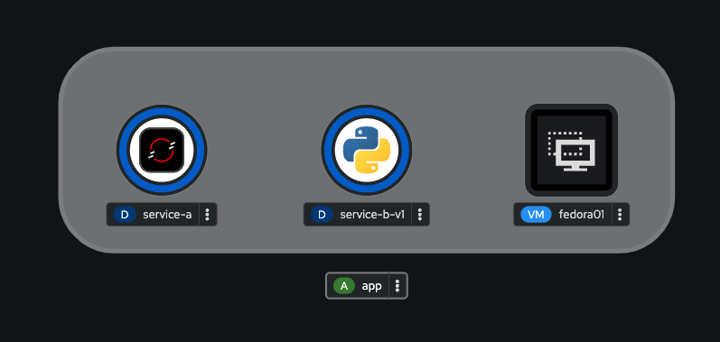
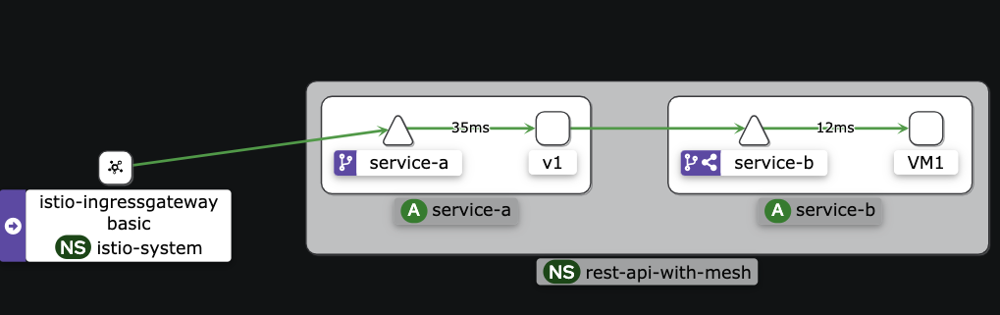
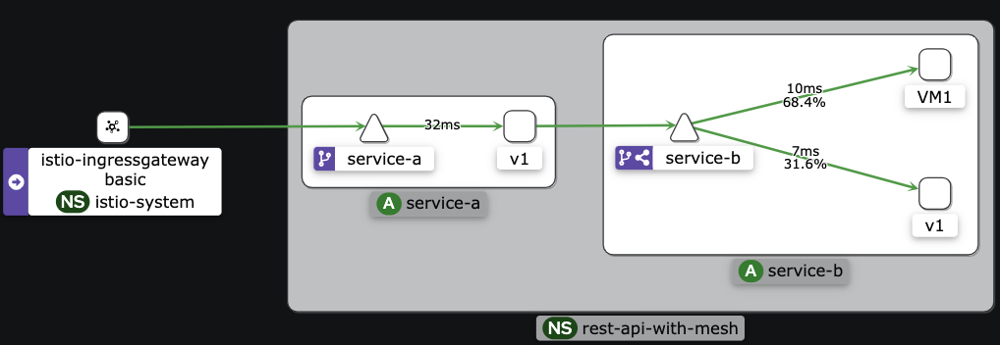
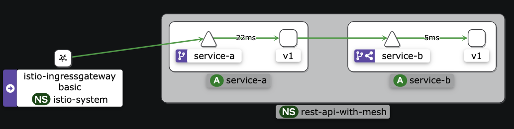

# OpenShift Virtualization with OpenShift Service Mesh


## Overview
The purpose of this demo is to demonstrate how to get additional value out of the OpenShift Platform, 
when looking at OCP as an option to host Virtual Machines (OpenShift Virtualization).   
   
This demo environment shows the integration of OpenShift Virtualization with Service Mesh, a component included with the OpenShift Container Platform (OCP).

### OpenShift Virtualization


OpenShift Virtualization is a feature within OpenShift, which is a platform designed to simplify the management of applications and services.

OpenShift Virtualization brings the ability to manage both traditional virtual machines and containerized applications within the same platform. This means you can run and manage VMs alongside containerized applications, offering a flexible and efficient alternative way to host and manage your VMs. It allows users to migrate existing virtualized workloads to OpenShift and manage them using Kubernetes concepts and tools, which can simplify operations and improve resource utilization. In essence, OpenShift Virtualization provides a modern, hybrid approach to application hosting that leverages both VMs and containers' strengths.


### OpenShift Service Mesh  


OpenShift Service Mesh is a dedicated infrastructure layer for handling communication between services in OpenShift. It's built on top of the popular open-source project Istio, and it provides a way to connect, manage, and secure microservices without having to modify their code. Here are the key benefits and features of OpenShift Service Mesh:

- Enhanced Communication Control: It gives you fine-grained control over how your services communicate with each other, including routing, load balancing, and failure recovery mechanisms.
    
- Security: Offers strong security features by default, including encrypted service-to-service communication, ensuring that sensitive data is protected as it moves within your cluster.
    
- Observability: Provides detailed insights into the behavior of your services, including metrics, logging, and tracing capabilities, which can help with debugging and monitoring.
    
- Simplified Operations: Automates many common networking tasks involved in managing microservices, reducing the complexity of deploying and managing your applications.

A standout feature of OpenShift Service Mesh is its support for various rollout strategies for deploying new versions of services, such as canary deployments.

Canary Deployment is a technique to reduce the risk of introducing a new software version in production by slowly rolling out the change to a small subset of users before making it available to everybody. The idea is to "release" the new version to a limited number of users (the "canaries") and monitor the performance and stability of the application. If everything goes well, the new version is gradually rolled out to the rest of the users. If issues are detected, the rollout can be halted or rolled back, minimizing the impact on the majority of users.

This capability allows developers to test new features and roll back if something goes wrong without affecting all users, providing a safer environment for continuous innovation and improvement. OpenShift Service Mesh facilitates implementing canary deployments and other sophisticated deployment strategies, enabling businesses to adopt a more agile and resilient approach to software delivery.

### OpenShift Virtualization with Service Mesh

OpenShift Virtualization allows for running VMs alongside containerized applications on the OpenShift platform. When you integrate these VMs with OpenShift Service Mesh, you essentially bring the advanced networking, security, and observability features of the service mesh to your virtualized workloads. This means that VMs can participate in the service mesh alongside containers, benefiting from consistent, policy-driven networking and security models.

Integrating VMs into OpenShift Service Mesh is especially beneficial for:

- Legacy Applications: For applications that are not yet containerized or cannot be easily transitioned to containers, running them in VMs within the Service Mesh allows them to benefit from modern development practices and infrastructure without a complete rewrite.

- Hybrid Applications: Applications that have components in both VMs and containers can interact more efficiently, with enhanced security and monitoring, facilitating a smoother migration path to fully containerized architectures.

## Demo: Non-disruptivly Migrating from a Legacy VM Based Application to Modern Container Based Application 

Migrating from a legacy VM-based application to a modern container-based application in a non-disruptive manner is a critical task for many organizations aiming to modernize their infrastructure without affecting their current operations. Using a Service Mesh, specifically with canary deployment strategies, provides a controlled and effective pathway for this transition. 

### Instructions

#### Install OpenShift Virtualization
Install OpenShift Virtualization using Operator Hub (as admin).

#### Install and configure OpenShift Service Mesh
*(logged in as admin)*
1. Install OpenShift Service Mesh using Operator Hub (as admin)

- Enable the following Service Mesh Operators 
  - OpenShift Elasticsearch Operator
  - Red Hat OpenShift distributed tracing platform
  - Kiali Operator (provided by Red Hat)
  - Red Hat OpenShift Service Mesh

*(logged in as user/non-admin)*   

2. Create a project called `istio-system`
3. While in the `isio-system` project, from the `Administrator` view:
   - `Operators->Installed Operators`
   - Click on `Red Hat OpenShift Service Mesh`
   - Click on `Create Instance` -> `Create` (default settings)
4. Observe the deployment on the Service Mesh Control Plane in the Topology view   

```
oc get pods -n istio-system
NAME                                    READY   STATUS    RESTARTS   AGE
grafana-7854c4bc44-6b97l                2/2     Running   0          7m45s
istio-egressgateway-5b6d946db7-7zk9t    1/1     Running   0          7m46s
istio-ingressgateway-7c64676496-vcknz   1/1     Running   0          7m46s
istiod-basic-69fcf6d7c8-h85tb           1/1     Running   0          8m31s
jaeger-85b69fbf95-7dggn                 2/2     Running   0          7m42s
kiali-7495b469df-v4qrq                  1/1     Running   0          7m1s
prometheus-6bc7d48f74-8gnn6             3/3     Running   0          8m18s
```

#### Deploy Kubernetes Resources

I have created a script that will deploy all the Custom Resources needed to set up the demo:    

```
./setup-demo.sh    

servicemeshmemberroll.maistra.io/default created
service/service-a created
service/service-b created
deployment.apps/service-a created
virtualmachine.kubevirt.io/fedora01 created
virtualservice.networking.istio.io/hello-vs created
gateway.networking.istio.io/hello-gateway created
virtualservice.networking.istio.io/service-b created
destinationrule.networking.istio.io/service-b-destination-rule created
```
Please note that you may need to wait a few minutes before the app is running on the VM becomes available (3-5 mins).

To test:
A REST API called `service-a` is a front-end API that is registered with the istio-gateway with two paths:
- `/hello` returns `{"message":"Hello World from service-a"}`
- `/hello-service` calls service-b (currently running on a Fedora VM) returns `{"response":{"message":"Hello World from fedora01"}}`


```
export GATEWAY=$(oc get route istio-ingressgateway -n istio-system -o template --template '{{ .spec.host }}')

❯ curl $GATEWAY/hello

{"message":"Hello World from service-a"}

❯ curl $GATEWAY/hello-service

{"response":{"message":"Hello World from fedora01"}}
```

### Start the Demo


To visualize this demo, you should use Kiali to observe traffic as it flows from `service-a` to `service-b`.
This will also let you observe traffic topology as it transitions from VM1 to the `service-b-v1` pod.

To get the URL for Kiali

```
oc get route kiali -n istio-system
```

You should also have two terminals open showing the responses change from `fedora01` to `service-b-v1` as the roll out occures and a window to show the roll out istelf happening.

- From terminal 1
```
 ./generate-traffic.sh
 
{"response":{"message":"Hello World from fedora01"}}

{"response":{"message":"Hello World from fedora01"}}

{"response":{"message":"Hello World from fedora01"}}
...
...
```

Once you have established service-b is returning a response from the VM, create a deployment of the service-b pod:

- From terminal 2
```
oc apply -f k8/deploy-serviceb-v1.yaml    

deployment.apps/service-b-v1 created
```
validate the deployment


```
oc get pods   

NAME                           READY   STATUS    RESTARTS   AGE
service-a-865d68dfdd-2dkfs     2/2     Running   0          32m
service-b-v1-c46576c9-2srwm    2/2     Running   0          45s
virt-launcher-fedora01-8vcgh   3/3     Running   0          32m
```
At this point there is no traffic going to the service-b-v1 pod

Initiate the role out to start directing traffic to the newly deployed pod

```
./deploy-VM1-v1.sh

virtualservice.networking.istio.io/service-b unchanged
all traffic is routed to VM1
virtualservice.networking.istio.io/service-b configured
90% traffic is routed to VM1 10% to pod
virtualservice.networking.istio.io/service-b configured
75% traffic is routed to VM1 25% to pod
virtualservice.networking.istio.io/service-b configured
50% traffic is routed to VM1 50% to pod
virtualservice.networking.istio.io/service-b configured
25% traffic is routed to VM1 75% to pod
virtualservice.networking.istio.io/service-b configured
10% traffic is routed to VM1 90% to pod
virtualservice.networking.istio.io/service-b configured
All traffic is routed to pod
```

You should slowly start seeing the output change from: 
```
{"response":{"message":"Hello World from fedora01"}}

{"response":{"message":"Hello World from fedora01"}}
...
...
```

to:
```
{"response":{"message":"Hello World from service-b-v1"}}

{"response":{"message":"Hello World from service-b-v1"}}

{"response":{"message":"Hello World from service-b-v1"}}
```

You can also observe this with Kiali (wich may lag behind by a minute)

In Kiali, make sure to display `Traffic Distribution`. `Response Time` is also good to display to show the benefits of running
the same workload in a container rather than a legacy VM.





## TODO
There is always room for improvement, but this demo was meant to keep it as simple as possible. This is open source, so feel free to make it better!
    
       
Some ideas:
- Migrate traffic and other Service Mesh functionality between VMs only
- Deploy rources with GitOps/ArgoCD
- Build the new ap/pod with Pipelines/Tekton
- Use Argo Rollouts to auto roll out the pod
- Promote between environments (dev/test/prod)
- More robust VM deployment
- etc...
