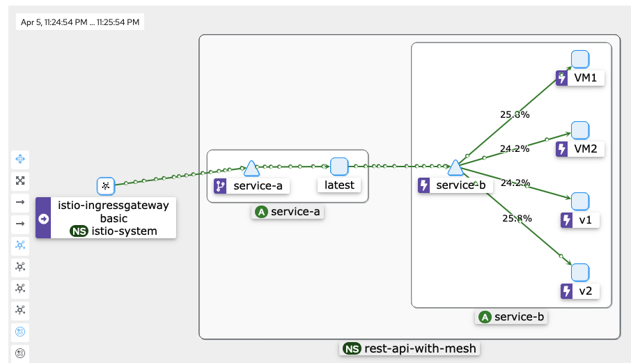

# python-rest-api

See `README.INSTRUCTIONS.md` for Canary roll out from VM to pod in OpenShift with Service Mesh.   
[link](./README.INSTRUCTIONS.md)

uses environment variable to set the name of the service
`SERVICE_LOCAL` (default value is `"python-rest-api"`)   

exampple:   
`export SERVICE_LOCAL="my-api"`   

To build and run a container:  

```
podman build -t python-rest-api .
podman run -e SERVICE_LOCAL=$SERVICE_LOCAL -p 8000:8080 python-rest-api
```

This command runs the podman container, mapping port 8000 on your local machine to port 8080 in the podman container (which your FastAPI app should be listening on).  
  
## To test locally

If you're not already doing so, consider using a virtual environment. This isolates your project's dependencies from the global Python environment and can often resolve conflicts and dependency issues.  
  
```
python -m venv venv
source venv/bin/activate  # For Unix or MacOS
venv\Scripts\activate     # For Windows

pip install --upgrade pip
pip install -r requirements.txt

export SERVICE_LOCAL="my-api"

uvicorn main:app --reload
```

Note: If using OpenShift DevSpaces, there is no need to create a virtual environment (venv). Also no need to run pip install locally.

## To clean up python virtual environment
- If you are currently inside a virtual environment, you'll need to deactivate it first. You can do this by running the deactivate command in your terminal or command prompt.  

```
deactivate
```

This will return you to your system's default Python environment.  
  
Once you've deactivated the virtual environment, you can simply delete its directory to remove it completely. The virtual environment is just a directory containing all the necessary files, so removing this directory will delete the environment.

```
rm -rf venv  # Unix/Linux/MacOS
rmdir /s /q venv  # Windows
```

You can use the yaml files found in the k8 directory:
- `k8/deploy-all` will deploy two containers using this code that I have pushed to a public registry
- `k8/deploy-serviceb-v2-yaml` will deploy a v2 tagged container of service b (to test load balancing and service mesh)  

```
oc create -f k8/deploy-all.yaml

oc create -f k8/deploy-serviceb-v2.yaml
```


For some swagger action:

```
<url>/docs
<url>/redocs
```
# OpenShift Service Mesh stuff
- Enable Service Mesh Operators (as admin)
  - OpenShift Elasticsearch Operator
  - Red Hat OpenShift distributed tracing platform
  - Kiali Operator (provided by Red Hat)
  - Red Hat OpenShift Service Mesh
- Create `istio-system` namespace/project (as dev/user)
- Create the Istio Service Mesh Control Plane instance in the 'istio-system' namespace (as dev/user)
- Add the project/namespace with the mesh enabled pods to the ServiceMeshMemberRole (can be done in OpenShift web terminal or apply example `ServiceMeshMemberRole.yaml` file to `istio-system` namespace)
    - `oc apply -f k8/ServiceMeshMemberRole.yaml -n istio-system`
- deploy the apps
```
oc apply -f k8/deploy-all.yaml                           
service/service-a created
service/service-b created
deployment.apps/service-a created
deployment.apps/service-b-v1 created
```
- Create a gateway in the app namespace (use `gateway.yaml` as an example)
  - `oc apply -f k8/gateway.yaml`
- Create VirtualService (use `virtualservice.yaml` as an example) this add
  - `oc apply -f k8/virtualservice.yaml`
```
oc get pods,svc,deploy,gw,vs                                                                           llevy-mac: Thu Apr  4 16:53:22 2024

NAME                               READY   STATUS    RESTARTS   AGE
pod/service-a-54655cfcf-vmtvc      2/2     Running   0          4m28s
pod/service-b-v1-5df564d98-ktjjp   2/2     Running   0          4m27s

NAME                TYPE        CLUSTER-IP       EXTERNAL-IP   PORT(S)    AGE
service/service-a   ClusterIP   172.31.253.42    <none>        8080/TCP   4m30s
service/service-b   ClusterIP   172.31.113.100   <none>        8080/TCP   4m29s

NAME                           READY   UP-TO-DATE   AVAILABLE   AGE
deployment.apps/service-a      1/1     1            1           4m29s
deployment.apps/service-b-v1   1/1     1            1           4m28s

NAME                                        AGE
gateway.networking.istio.io/hello-gateway   89s

NAME                                          GATEWAYS            HOSTS   AGE
virtualservice.networking.istio.io/hello-vs   ["hello-gateway"]   ["*"]   18s
```

- now you should be able to access the service through the ingress gatway

```
oc get route istio-ingressgateway -n istio-system                    
NAME                   HOST/PORT                 
istio-ingressgateway   istio-ingressgateway-istio-system.apps.<domain>  
```

- same for other services like kiali


```
NAME    HOST/PORT                        
kiali   kiali-istio-system.apps.<domain> 
```

- access the API through the gateway

```
curl istio-ingressgateway-istio-system.apps.cluster-b5pcr.dynamic.redhatworkshops.io/hello
{"message":"Hello World from service-a"}

❯ curl istio-ingressgateway-istio-system.apps.cluster-b5pcr.dynamic.redhatworkshops.io/hello-service
{"response":{"message":"Hello World from service-b-v1"}}
```
# OpenShift VM
I have added some additional examples of a VM that can also be tied to the `service-b` service. 
The `cloud-init.yaml` can be copy/pasted into the cloud init at the time of VM provisioning. 
the `deploy-fedora-vm.yaml` is only meant to be an example and cannot be deployed yet (I'll fix it sometime)

As you can see the I have two VMs that are now part of the service mesh:



```
oc get pods,vmi,vm                                                                                                                                                                 llevy-mac: Fri Apr  5 23:27:13 2024

NAME                                READY   STATUS    RESTARTS   AGE
pod/service-a-54655cfcf-vmtvc       2/2     Running   0          30h
pod/service-b-v1-c46576c9-96fcf     2/2     Running   0          24m
pod/service-b-v2-6cc98d7dc4-nmsqp   2/2     Running   0          24m
pod/virt-launcher-fedora01-8bsgn    2/2     Running   0          63m
pod/virt-launcher-fedora02-j2j6p    2/2     Running   0          62m

NAME                                          AGE   PHASE     IP            NODENAME                 READY
virtualmachineinstance.kubevirt.io/fedora01   63m   Running   10.132.2.46   worker-cluster-82j5r-2   True
virtualmachineinstance.kubevirt.io/fedora02   62m   Running   10.133.2.61   worker-cluster-82j5r-3   True
```

- TODO: service-a talk to a virtual service  of service-b
- TODO: Network shaping between releases